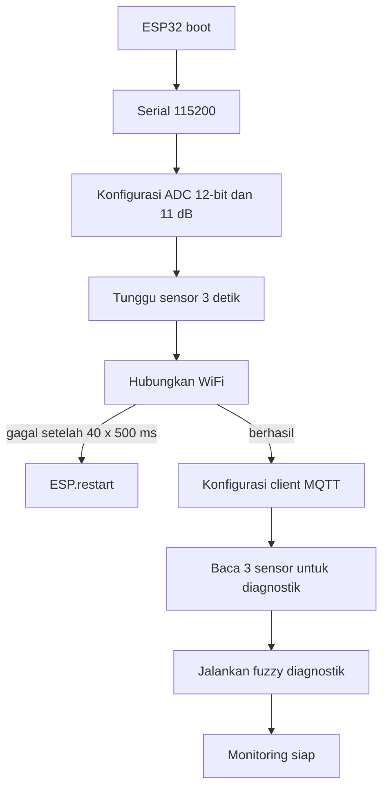
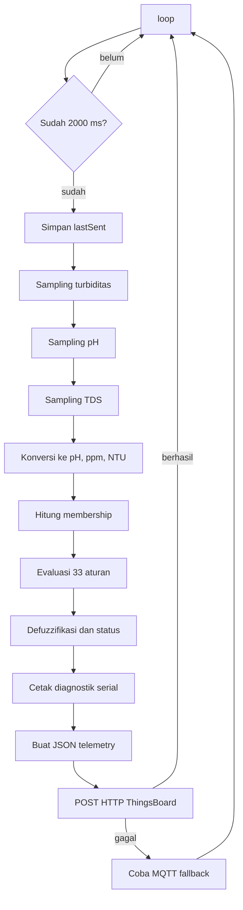
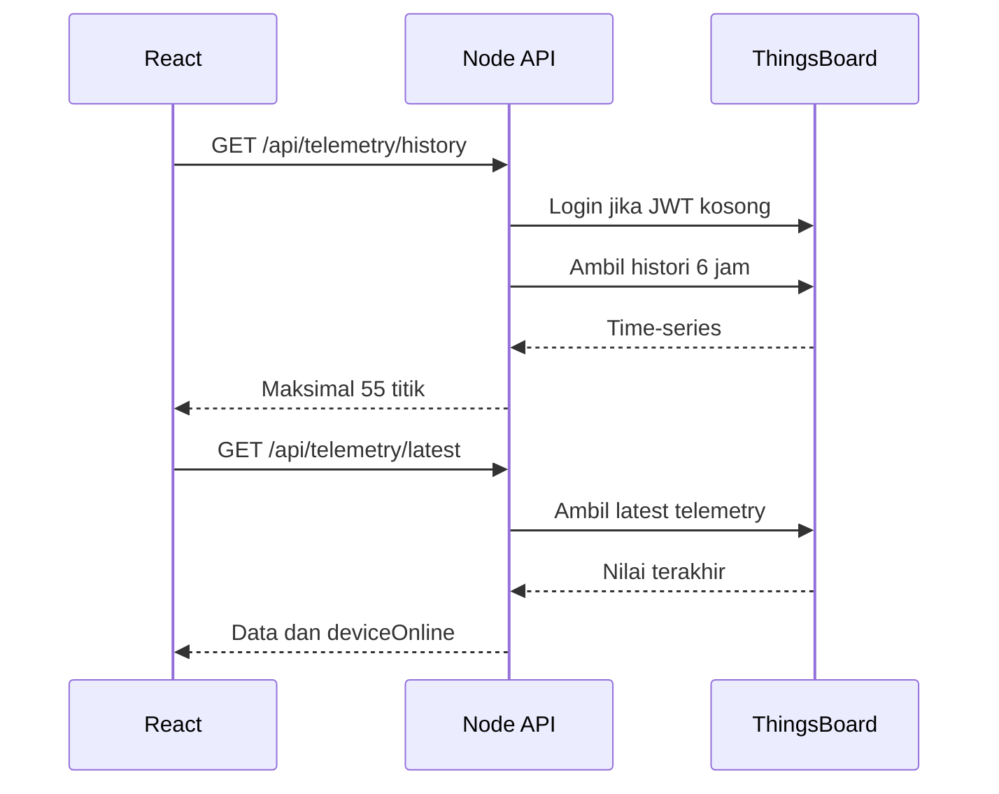

# Dokumentasi Lengkap Proyek AquaSense

Dokumen ini menjelaskan struktur, arsitektur, aliran data, firmware, logika
fuzzy, integrasi ThingsBoard, API lokal, dashboard React, konfigurasi, dan
batasan proyek AquaSense berdasarkan implementasi yang saat ini ada di
repository.

> Catatan keamanan: nilai SSID, password WiFi, access token device, username,
> dan password tenant sengaja tidak ditulis di dokumen ini.

## 1. Ringkasan Proyek

AquaSense adalah sistem pemantauan kualitas air asam tambang pasca
bio-filtrasi. Sistem mengukur tiga parameter:

- pH menggunakan modul PH-4502C.
- Total Dissolved Solids (TDS) menggunakan TDS Meter V1.0.
- Turbiditas menggunakan sensor AB147.

ESP32 membaca ketiga sensor, melakukan inferensi fuzzy secara lokal, lalu
mengirim hasilnya ke ThingsBoard. Dashboard lokal tidak menghitung ulang
fuzzy. Dashboard hanya membaca dan menampilkan nilai sensor serta hasil fuzzy
yang sudah dihitung oleh ESP32.

Arsitektur utamanya:

```text
Sensor
  |
  v
ESP32 -> pembacaan ADC -> konversi sensor -> fuzzy -> JSON telemetry
  |
  | HTTP utama, MQTT fallback
  v
ThingsBoard
  |
  | REST API tenant
  v
Node.js API bridge
  |
  ├── /api/telemetry/latest dan /api/telemetry/history
  ├── /api/telemetry/export   (CSV/JSON download)
  ├── /api/telemetry/reset    (hapus data Supabase)
  └── /api/telemetry/files    (daftar file JSON lokal)
  |
  v
React dashboard
```

### Dual Storage (Supabase + JSON Lokal)

Setiap data telemetry yang diambil dari ThingsBoard disimpan ke **dua tempat**:

```
Node API
   |
   ├── JSON file (lokal) → folder data/telemetry-YYYY-MM-DD.json
   └── Supabase (cloud)  → table telemetry (untuk Vercel/production)
```

- **JSON file**: backup lokal, tetap jalan walau tanpa Supabase.
- **Supabase**: untuk export CSV/JSON di Vercel / production.

## 2. Tujuan Setiap Lapisan

| Lapisan | Tanggung jawab |
| --- | --- |
| Sensor | Menghasilkan sinyal analog pH, TDS, dan turbiditas |
| ESP32 | Sampling ADC, kalibrasi, fuzzy, serial debug, pengiriman telemetry |
| ThingsBoard | Menyimpan latest telemetry dan histori time-series |
| Node API | Login tenant, mengambil telemetry, normalisasi data, cache, static hosting, auto-save ke Supabase & JSON file |
| React | Menampilkan status, gauge, grafik, visualisasi air, dan log |

Pemisahan ini penting karena:

- Keputusan kualitas air tetap dibuat oleh perangkat melalui fuzzy.
- ThingsBoard menjadi penyimpanan dan sumber histori.
- Credential tenant tidak dikirim ke browser.
- Dashboard dapat tetap menampilkan data terakhir walaupun ESP32 baru dicabut.

## 3. Tech Stack

### 3.1 Embedded dan perangkat keras

| Teknologi | Pemakaian |
| --- | --- |
| ESP32 Dev Kit V4 | Mikrokontroler dan koneksi WiFi |
| Arduino framework | Runtime firmware |
| PlatformIO | Build, upload, dependency, dan serial monitor |
| PH-4502C | Sensor pH pada GPIO34 |
| TDS Meter V1.0 | Sensor TDS pada GPIO35 |
| Turbidity AB147 | Sensor turbiditas pada GPIO32 |
| ADC ESP32 | Resolusi 12-bit, atenuasi 11 dB |

### 3.2 Library firmware

| Library | Fungsi |
| --- | --- |
| `WiFi.h` | Koneksi ESP32 ke WiFi |
| `HTTPClient.h` | Pengiriman telemetry HTTP ke ThingsBoard |
| `PubSubClient` 2.8+ | MQTT fallback |
| `ArduinoJson` 6.21.5+ | Penyusunan payload JSON |

`WiFi.h` dan `HTTPClient.h` berasal dari Arduino core ESP32. `PubSubClient`
dan `ArduinoJson` dikelola oleh PlatformIO melalui `platformio.ini`.

### 3.3 Backend dan frontend

| Teknologi | Versi proyek | Fungsi |
| --- | --- | --- |
| Node.js | Direkomendasikan 22+ | API bridge dan static server |
| React | `^19.2.6` | UI dashboard |
| React DOM | `^19.2.6` | Render React ke browser |
| Recharts | `^3.8.1` | Grafik time-series |
| Vite | `^8.0.12` | Dev server dan build frontend |
| ESLint | `^10.3.0` | Pemeriksaan kode JavaScript/JSX |
| **@supabase/supabase-js** | latest | Client Supabase untuk cloud storage |

Backend hanya memakai modul bawaan Node.js dan global `fetch`. Tidak ada
framework Express.

## 4. Struktur Folder

```text
aquasense/
|-- .env
|-- .env.example
|-- .gitignore
|-- data/
|   `-- telemetry-2026-07-29.json     (auto-generated, di-gitignore)
|-- docs/
|   |-- PROJECT_DOCUMENTATION.md
|   |-- THINGSBOARD_SETUP.md
|   |-- SUPABASE_SETUP.md
|   |-- VERCEL_DEPLOYMENT.md
|   `-- PENJELASAN_FRAMEWORK.md
|-- firmware/
|   `-- main.cpp
|-- public/
|   |-- favicon.svg
|   `-- icons.svg
|-- api/                               (Vercel serverless functions)
|   |-- health.js
|   `-- telemetry/
|       |-- export.js
|       |-- history.js
|       `-- reset.js
|-- server/
|   |-- config.js
|   |-- data-service.js               (JSON file storage)
|   |-- http-utils.js
|   |-- index.js
|   |-- supabase-service.js           (Supabase cloud storage)
|   |-- telemetry-service.js
|   `-- thingsboard-client.js
|-- src/
|   |-- components/
|   |   |-- ui/
|   |   |   `-- Widgets.jsx
|   |   |-- AquaSense.jsx             (komposisi utama)
|   |   |-- Header.jsx                (header + export/reset)
|   |   |-- StatusHero.jsx            (status kualitas air)
|   |   |-- GaugeRow.jsx              (gauge sensor)
|   |   |-- ChartRow.jsx              (grafik + visualisasi)
|   |   `-- FlowLogRow.jsx            (diagram alur + log)
|   |-- hooks/
|   |   `-- useTelemetry.js
|   |-- styles/
|   |   `-- AquaSense.css
|   |-- utils/
|   |   `-- theme.js
|   |-- App.jsx
|   |-- main.jsx
|   `-- monitor_air_asam_tambang.ino
|-- eslint.config.js
|-- index.html
|-- package.json
|-- platformio.ini
|-- README.md
`-- vite.config.js
```

### 4.1 Folder sumber utama

| Folder | Isi |
| --- | --- |
| `firmware/` | Entry point yang dikenali PlatformIO |
| `src/` | Firmware asli dan source code dashboard React |
| `server/` | API lokal yang menghubungkan dashboard ke ThingsBoard |
| `api/` | Serverless functions untuk deployment Vercel |
| `public/` | File statis yang disalin Vite tanpa pemrosesan |
| `docs/` | Dokumentasi proyek dan panduan |
| `data/` | File JSON telemetry lokal (di-gitignore) |

### 4.2 Folder hasil generate

| Folder | Dibuat oleh | Keterangan |
| --- | --- | --- |
| `node_modules/` | npm | Dependency JavaScript lokal |
| `dist/` | Vite | Hasil build frontend untuk mode produksi |

Folder generate tidak berisi logika bisnis utama dan umumnya tidak perlu
diedit manual.

## 5. Penjelasan Setiap File

### 5.1 File firmware

#### `src/monitor_air_asam_tambang.ino`

Ini adalah sumber utama firmware dan pusat logika sistem. Isinya:

- Konfigurasi WiFi dan ThingsBoard.
- Penentuan pin sensor.
- Konfigurasi dan kalibrasi ADC.
- Pembacaan pH, TDS, dan turbiditas.
- Fungsi keanggotaan fuzzy.
- 33 pemanggilan aturan fuzzy.
- Defuzzifikasi dan klasifikasi kualitas air.
- Penyusunan payload JSON.
- Pengiriman HTTP dengan MQTT fallback.
- Output diagnostik ke Serial Monitor.
- Fungsi Arduino `setup()` dan `loop()`.

File inilah yang menentukan nilai fuzzy. Backend dan frontend tidak
mengubah hasil tersebut.

#### `firmware/main.cpp`

PlatformIO dikonfigurasi memakai `firmware/` sebagai source directory.
`main.cpp` menyediakan entry point C++ yang mengimpor library Arduino lalu
menyertakan firmware asli:

```cpp
#include "../src/monitor_air_asam_tambang.ino"
```

Dengan pola ini:

- File `.ino` tetap menjadi sumber logika tunggal.
- Tidak perlu menduplikasi atau memindahkan isi firmware.
- PlatformIO dapat mengompilasi firmware melalui `main.cpp`.

### 5.2 File backend

#### `server/index.js`

Entry point backend yang menangani:

1. Membuat HTTP server.
2. Mendefinisikan route API.
3. Meneruskan pekerjaan ke service terkait.
4. Mengubah error menjadi respons `503`.
5. Menjalankan server pada port yang dikonfigurasi.

Endpoint yang tersedia:

| Method | Endpoint | Fungsi |
| --- | --- | --- |
| `GET` | `/api/health` | Memeriksa server dan kelengkapan konfigurasi |
| `GET` | `/api/telemetry/latest` | Mengambil telemetry terbaru |
| `GET` | `/api/telemetry/history` | Mengambil histori time-series |
| `GET` | `/api/telemetry/export` | Download data sebagai CSV/JSON |
| `POST` | `/api/telemetry/reset` | Hapus semua data di Supabase (protected token) |
| `GET` | `/api/telemetry/files` | Daftar file JSON lokal yang tersedia |

#### `server/config.js`

Memuat `.env`, menyusun konfigurasi aplikasi, memvalidasi credential
ThingsBoard, dan menyediakan pemeriksaan status konfigurasi untuk endpoint
health.

#### `server/thingsboard-client.js`

Menangani komunikasi tingkat rendah dengan ThingsBoard:

- Login akun tenant.
- Menyimpan dan memperbarui JWT.
- Mengulang request sekali ketika menerima `401`.
- Menentukan device berdasarkan ID atau nama.

#### `server/telemetry-service.js`

Menangani logika data telemetry:

- Daftar key latest dan history.
- Normalisasi number, boolean, dan status.
- Pengambilan latest telemetry.
- Pengambilan dan penggabungan histori.
- Dedup burst telemetry.
- Cache latest 500 ms dan history 5 detik.
- Auto-save ke JSON file lokal dan Supabase (hanya saat timestamp baru).

#### `server/data-service.js`

Menyimpan data telemetry ke file JSON lokal:

- Buffer data di memory, flush ke disk setiap 5 detik.
- Rotasi file per hari (`telemetry-YYYY-MM-DD.json`).
- Maksimal 50.000 titik per file.
- Menyediakan fungsi untuk membaca dan menggabungkan data dari file.
- Format timestamp menggunakan WIB (UTC+7).

#### `server/supabase-service.js`

Menghubungkan ke Supabase untuk cloud storage:

- Membuat client Supabase dari environment variable.
- `saveTelemetryToSupabase(point)` — insert data ke tabel `telemetry`.
- `getHistoryFromSupabase({ date, limit })` — baca data historis.
- `resetTelemetryInSupabase()` — hapus semua data (dipanggil dari endpoint reset).
- Format timestamp menggunakan WIB (UTC+7).

#### `server/http-utils.js`

Berisi helper respons JSON dan penyajian file statis dari folder `dist/`.

### 5.3 File Vercel serverless

#### `api/health.js`

Serverless function untuk health check di Vercel.

#### `api/telemetry/history.js`

Serverless function untuk mengambil histori telemetry dari ThingsBoard di Vercel.

#### `api/telemetry/export.js`

Serverless function untuk export CSV/JSON dari Supabase di Vercel.

#### `api/telemetry/reset.js`

Serverless function untuk reset data Supabase di Vercel (protected dengan token).

### 5.4 File frontend

#### `src/main.jsx`

Entry point React:

1. Mengimpor global CSS.
2. Mencari elemen HTML `#root`.
3. Merender `<App />` melalui `createRoot`.
4. Membungkus aplikasi dengan `StrictMode`.

#### `src/App.jsx`

Komponen root yang hanya merender komponen utama:

```jsx
<AquaSense />
```

#### `src/components/AquaSense.jsx`

Komposisi utama dashboard. Sekarang hanya berisi layout dan komposisi
komponen yang sudah dipecah:

- `Header` — Header + tombol Export & Reset.
- `StatusHero` — Status kualitas air dan metrics.
- `GaugeRow` — Gauge pH, TDS, NTU, dan Fuzzy Score.
- `ChartRow` — Grafik Recharts + visualisasi sampel air.
- `FlowLogRow` — Diagram alur bio-filtrasi + tabel log.

#### `src/components/Header.jsx`

Komponen header sticky. Tanggung jawabnya:

- Menampilkan brand AquaSense.
- Status koneksi (LIVE/STALE/OFFLINE/CONNECTING).
- Jam browser dan uptime halaman.
- Badge KIC 2026 & PROTOTYPE.
- Tombol **EXPORT CSV** (download data historis).
- Tombol **RESET** (hapus data Supabase, butuh token).

#### `src/components/StatusHero.jsx`

Menampilkan status kualitas air utama:

- Indikator status dengan animasi pulse.
- Status kualitas air (LAYAK / PERLU TREATMENT / TIDAK LAYAK).
- Rekomendasi tindakan.
- Metrics singkat pH, TDS, NTU dengan indikator OK/WARN.

#### `src/components/GaugeRow.jsx`

Menampilkan gauge sensor:

- 3 gauge sensor (pH, TDS, NTU) menggunakan `ArcGauge`.
- 1 gauge Fuzzy Score menggunakan `ScoreRing`.
- Status per parameter (OK/WARN/ERROR).

#### `src/components/ChartRow.jsx`

Menampilkan grafik dan visualisasi sampel air:

- Grafik time-series 4 seri (pH, TDS, NTU, Fuzzy Score) menggunakan Recharts.
- 4 YAxis terpisah agar skala tidak saling memengaruhi.
- Visualisasi sampel air (`WaterSample`).
- Progress bar per parameter (`ParamBar`).

#### `src/components/FlowLogRow.jsx`

Menampilkan diagram alur dan tabel log:

- Diagram proses bio-filtrasi (`FlowDiagram`).
- Spesifikasi sistem (ESP32, Fuzzy Logic, ThingsBoard, dll).
- Tabel log 8 baris terakhir dengan animasi baris baru.

#### `src/components/ui/Widgets.jsx`

Berisi komponen UI reusable:

| Komponen | Fungsi |
| --- | --- |
| `ArcGauge` | Gauge SVG untuk pH, TDS, dan NTU |
| `ScoreRing` | Gauge lingkaran fuzzy score |
| `WaterSample` | Visualisasi warna dan partikel sampel air |
| `ParamBar` | Progress bar dan status per parameter |
| `FlowDiagram` | Diagram proses bio-filtrasi sampai monitoring |
| `ChartTip` | Tooltip custom untuk grafik |

Semua komponen gauge dibuat menggunakan SVG dan tidak memerlukan library
gauge tambahan.

#### `src/hooks/useTelemetry.js`

Hook ini mengelola seluruh pengambilan data browser:

- Memuat histori ketika halaman pertama dibuka.
- Melakukan polling latest telemetry.
- Menyimpan nilai terbaru, grafik, log, dan status koneksi.
- Mencegah request polling tumpang tindih.
- Membatasi histori tampilan menjadi 55 titik.
- Membatasi log tabel menjadi 8 baris.
- Mengurangi polling ketika tab browser tidak aktif.
- Membatalkan request saat komponen dilepas.

Konstanta utamanya:

```text
POLL_MS            = 1000 ms
HIDDEN_POLL_MS     = 10000 ms
REQUEST_TIMEOUT_MS = 8000 ms
```

#### `src/utils/theme.js`

Menyimpan palet warna global:

- Cyan untuk aksen.
- Biru untuk pH.
- Hijau untuk TDS.
- Kuning untuk NTU.
- Ungu untuk fuzzy.
- Hijau, kuning, dan merah untuk status.

#### `src/styles/AquaSense.css`

File style aktif yang diimpor oleh `AquaSense.jsx`. Isinya:

- Import Google Fonts `Chakra Petch` dan `IBM Plex Mono`.
- Reset margin dan `box-sizing`.
- Scrollbar custom.
- Animasi pulse, float, row baru, dan glow.
- Style dasar kartu dan hover tabel.
- Class `.card`, `.pls`, `.flt`, `.trh`, dan `.nw-anim`.

### 5.5 File konfigurasi

#### `platformio.ini`

Konfigurasi build firmware:

```ini
[platformio]
src_dir = firmware

[env:esp32dev]
platform = espressif32
board = esp32dev
framework = arduino
monitor_speed = 115200
upload_port = COM3
monitor_port = COM3
upload_speed = 115200
```

Implikasinya:

- Environment PlatformIO bernama `esp32dev`.
- Board profile menggunakan ESP32 Dev Module.
- Upload dan monitor saat ini dikunci ke `COM3`.
- Serial Monitor memakai 115200 baud.

Jika nomor COM berubah setelah perangkat dicabut dan dipasang ulang, nilai
`upload_port` dan `monitor_port` harus disesuaikan.

#### `package.json`

Mendefinisikan dependency dan script npm:

| Script | Perintah | Fungsi |
| --- | --- | --- |
| `npm run dev` | `vite` | Menjalankan frontend development |
| `npm run server` | `node server/index.js` | Menjalankan API sekali |
| `npm run server:dev` | `node --watch server/index.js` | API dengan auto-restart |
| `npm start` | `node server/index.js` | Menjalankan mode produksi |
| `npm run build` | `vite build` | Membuat folder `dist/` |
| `npm run lint` | `eslint .` | Memeriksa JavaScript dan JSX |
| `npm run preview` | `vite preview` | Preview hasil build Vite |

#### `vite.config.js`

Mengaktifkan plugin React dan proxy development:

```text
/api/* -> http://localhost:3001
```

Browser mengakses API melalui origin Vite, lalu Vite meneruskannya ke Node.
Ini menghindari kebutuhan konfigurasi CORS pada development lokal.

#### `eslint.config.js`

Mengaktifkan:

- Rule JavaScript yang direkomendasikan.
- Rule React Hooks.
- Rule React Refresh untuk Vite.
- Global browser untuk frontend.
- Global Node untuk file di `server/` dan `api/`.
- Pengabaian folder `dist/`.

#### `.env.example`

Template konfigurasi Node API. Variabelnya:

| Variabel | Fungsi |
| --- | --- |
| `TB_BASE_URL` | Origin ThingsBoard yang dapat diakses server |
| `TB_USERNAME` | Username akun tenant |
| `TB_PASSWORD` | Password akun tenant |
| `TB_DEVICE_ID` | UUID device, pilihan utama |
| `TB_DEVICE_NAME` | Fallback pencarian device berdasarkan nama |
| `SUPABASE_URL` | URL project Supabase (untuk cloud storage) |
| `SUPABASE_KEY` | Anon public key Supabase |
| `RESET_TOKEN` | Token rahasia untuk endpoint reset data |
| `API_PORT` | Port Node API, default 3001 |
| `TB_STALE_AFTER_MS` | Batas umur data sebelum device dianggap stale |

`TB_BASE_URL` harus berisi origin lengkap yang benar, termasuk port apabila
ThingsBoard tidak berjalan pada port default.

#### `.env`

Berisi nilai konfigurasi asli yang dipakai server lokal. File ini diabaikan
Git dan tidak boleh dibagikan karena berisi credential tenant.

#### `.gitignore`

Mengabaikan file hasil generate dan rahasia seperti:

- `node_modules`
- `dist`
- `.env`
- `.pio`
- `data/` (folder data telemetry lokal)
- log
- sebagian konfigurasi editor

## 6. Konfigurasi Hardware dan ADC

### 6.1 Pin sensor

| Sensor | Pin ESP32 | Kanal | Catatan |
| --- | --- | --- | --- |
| pH | GPIO34 | ADC1_CH6 | Input-only |
| TDS | GPIO35 | ADC1_CH7 | Input-only |
| Turbiditas | GPIO32 | ADC1_CH4 | ADC1 |

Semua sensor memakai ADC1 agar tetap dapat dibaca ketika WiFi ESP32 aktif.
Pada ESP32, ADC2 dapat konflik dengan WiFi.

### 6.2 Parameter ADC

```text
ADC_BITS = 12
ADC_MAX  = 4095
ADC_VREF = 3.3 V
```

Konversi raw ADC menjadi tegangan:

```text
voltage = raw / 4095 * 3.3
```

Firmware juga menjalankan:

```cpp
analogReadResolution(12);
analogSetAttenuation(ADC_11db);
```

### 6.3 Sampling

Setiap pemanggilan `adcAvg(pin)`:

1. Membaca ADC sebanyak 30 kali.
2. Memberi delay 10 ms di setiap pembacaan.
3. Menjumlahkan seluruh raw ADC.
4. Mengembalikan rata-rata.

Perkiraan minimum waktu satu batch:

```text
30 sampel x 10 ms = 300 ms
```

Dalam loop normal ada tiga batch:

```text
turbiditas + pH + TDS = sekitar 900 ms
```

Nilai turbiditas di loop hanya disampling satu kali lalu hasil tegangan yang
sama dipakai untuk debug dan telemetry.

## 7. Konversi Nilai Sensor

### 7.1 pH

Konstanta saat ini:

```text
PH_VOLT_AT7 = 2.42 V
PH_SLOPE    = 0.0592 V/pH
PH_OFFSET   = -3.0
```

Rumus:

```text
pH = 7 + (PH_VOLT_AT7 - voltage) / PH_SLOPE + PH_OFFSET
```

Hasil dibatasi ke rentang `0 sampai 14`.

`readPH()` juga mencetak raw ADC dan tegangan agar kalibrasi dapat diperiksa
melalui Serial Monitor.

### 7.2 TDS

Konstanta:

```text
TDS_K    = 0.5
TDS_TEMP = 25 C
```

Kompensasi tegangan suhu:

```text
vc = voltage / (1 + 0.02 * (temperature - 25))
```

Konversi TDS:

```text
TDS = (133.42 * vc^3 - 255.86 * vc^2 + 857.39 * vc) * TDS_K
```

Hasil dibatasi ke `0 sampai 5000 ppm`.

Karena `TDS_TEMP` tetap 25 C dan tidak ada sensor suhu, kompensasi saat ini
bersifat konstan.

### 7.3 Turbiditas

Konstanta implementasi:

```text
TURB_V_CLEAR  = 1.67 V
TURB_V_TURBID = 1.49 V
```

`turbidityFromVoltage()` memetakan:

```text
1.67 V -> 0 NTU
1.49 V -> 1000 NTU
```

Nilai di antaranya dipetakan linear menggunakan fungsi Arduino `map()`, lalu
dibatasi ke `0 sampai 1000 NTU`.

Konsekuensinya:

- Tegangan sama atau lebih tinggi dari batas jernih cenderung menjadi 0 NTU.
- Tegangan sama atau lebih rendah dari batas keruh cenderung menjadi 1000 NTU.
- Perubahan kecil pada tegangan dapat menghasilkan perubahan NTU besar karena
  rentang kalibrasinya hanya 0.18 V.

## 8. Logika Fuzzy

### 8.1 Posisi fuzzy dalam sistem

Fuzzy dijalankan setelah tiga nilai sensor selesai dihitung:

```text
pH + TDS + NTU -> fuzzifikasi -> evaluasi rule -> weighted average
                -> score 0-100 -> status dan rekomendasi
```

Dashboard tidak mengulang proses tersebut.

### 8.2 Fungsi keanggotaan

Semua himpunan menggunakan fungsi trapesium:

```text
mfTrap(x, a, b, c, d)
```

Perilakunya:

- `0` jika `x < a` atau `x > d`.
- `1` jika `b <= x <= c`.
- Naik linear dari `a` ke `b`.
- Turun linear dari `c` ke `d`.
- Mendukung bahu kiri ketika `a = b`.
- Mendukung bahu kanan ketika `c = d`.

### 8.3 Himpunan pH

| Kode | Nama | Parameter trapesium |
| --- | --- | --- |
| `pSA` | Sangat Asam | `[0, 0, 3, 5]` |
| `pA` | Asam | `[3, 4.5, 6, 7]` |
| `pN` | Netral | `[5.5, 6.5, 7.5, 9]` |
| `pB` | Basa | `[7.5, 9, 14, 14]` |

### 8.4 Himpunan TDS

| Kode | Nama | Parameter trapesium, ppm |
| --- | --- | --- |
| `tL` | Rendah | `[0, 0, 200, 500]` |
| `tM` | Sedang | `[150, 400, 600, 1000]` |
| `tH` | Tinggi | `[600, 900, 1400, 2000]` |
| `tVH` | Sangat Tinggi | `[1400, 2000, 5000, 5000]` |

### 8.5 Himpunan turbiditas

| Kode | Nama | Parameter trapesium, NTU |
| --- | --- | --- |
| `nJ` | Jernih | `[0, 0, 5, 30]` |
| `nAK` | Agak Keruh | `[5, 20, 60, 100]` |
| `nK` | Keruh | `[50, 100, 250, 500]` |
| `nSK` | Sangat Keruh | `[300, 600, 3000, 3000]` |

### 8.6 Operator fuzzy

Operator AND menggunakan nilai minimum:

```text
strength = min(muA, muB, muC)
```

Macro `R(strength, output)` mengakumulasi:

```text
ws += strength * output
wt += strength
```

### 8.7 Daftar 33 aturan

Implementasi aktual memiliki 33 pemanggilan aturan.

#### Kelompok 1: Layak, 4 aturan

| No. | Kondisi | Singleton |
| --- | --- | ---: |
| 1 | Netral AND TDS rendah AND jernih | 95 |
| 2 | Netral AND TDS rendah AND agak keruh | 85 |
| 3 | Netral AND TDS sedang AND jernih | 80 |
| 4 | Netral AND TDS sedang AND agak keruh | 72 |

#### Kelompok 2: Perlu treatment kondisi umum, 9 aturan

| No. | Kondisi | Singleton |
| --- | --- | ---: |
| 5 | Netral AND TDS tinggi AND jernih | 65 |
| 6 | Netral AND TDS sedang AND keruh | 60 |
| 7 | Netral AND TDS rendah AND keruh | 58 |
| 8 | Asam AND TDS rendah AND jernih | 58 |
| 9 | Netral AND TDS tinggi AND agak keruh | 55 |
| 10 | Asam AND TDS sedang AND jernih | 52 |
| 11 | Netral AND keruh | 55 |
| 12 | Asam AND TDS rendah AND agak keruh | 50 |
| 13 | Netral AND sangat keruh | 45 |

#### Kelompok 3: Perlu treatment air basa, 9 aturan

| No. | Kondisi | Singleton |
| --- | --- | ---: |
| 14 | Basa | 60 |
| 15 | Basa AND TDS sedang | 57 |
| 16 | Basa AND TDS tinggi | 53 |
| 17 | Basa AND TDS sangat tinggi | 48 |
| 18 | Basa AND agak keruh | 58 |
| 19 | Basa AND keruh | 54 |
| 20 | Basa AND sangat keruh | 47 |
| 21 | Basa AND TDS tinggi AND keruh | 51 |
| 22 | Basa AND TDS sangat tinggi AND sangat keruh | 44 |

#### Kelompok 4: Tidak layak, 11 aturan

| No. | Kondisi | Singleton |
| --- | --- | ---: |
| 23 | Sangat asam | 15 |
| 24 | Sangat asam AND TDS rendah | 20 |
| 25 | Sangat asam AND agak keruh | 16 |
| 26 | Sangat asam AND keruh | 14 |
| 27 | Sangat asam AND sangat keruh | 10 |
| 28 | Sangat asam AND TDS rendah AND agak keruh | 17 |
| 29 | Sangat asam AND TDS rendah AND keruh | 14 |
| 30 | Sangat asam AND TDS rendah AND sangat keruh | 10 |
| 31 | Asam AND TDS tinggi AND sangat keruh | 22 |
| 32 | Asam AND TDS sangat tinggi AND jernih | 32 |
| 33 | Netral AND TDS sangat tinggi AND sangat keruh | 28 |

### 8.8 Defuzzifikasi

Skor akhir:

```text
score = sum(strength * singleton) / sum(strength)
```

Jika tidak ada aturan aktif:

```text
score = 50
```

Skor kemudian dibatasi ke `0 sampai 100`.

### 8.9 Klasifikasi output

| Score | Level | Label | Rekomendasi |
| --- | ---: | --- | --- |
| `>= 70` | 2 | `LAYAK` | Air layak digunakan |
| `>= 40` dan `< 70` | 1 | `PERLU_TREATMENT` | Netralisasi/filtrasi sebelum digunakan |
| `< 40` | 0 | `TIDAK_LAYAK` | Pengolahan intensif diperlukan |

## 9. Alur Firmware

### 9.1 Alur `setup()`



`connectWiFi()` mencoba maksimal sekitar 20 detik. Jika tetap gagal,
perangkat restart.

### 9.2 Alur `loop()`



`lastSent` dicatat sebelum proses sampling. Karena sampling sekitar 900 ms,
interval awal siklus tetap ditargetkan setiap 2 detik selama pengiriman tidak
memblokir terlalu lama.

### 9.3 Pengiriman HTTP dan fallback MQTT

URL HTTP:

```text
http://TB_HOST:TB_HTTP_PORT/api/v1/TB_TOKEN/telemetry
```

Konfigurasi timeout:

```text
HTTP connect timeout = 1000 ms
HTTP total timeout   = 1500 ms
MQTT socket timeout  = 1 detik
```

Urutannya:

1. Firmware mencoba HTTP POST.
2. Status HTTP `200 sampai 299` dianggap berhasil.
3. Jika HTTP gagal, firmware mencoba satu koneksi MQTT singkat.
4. Jika MQTT tersambung, payload dipublish ke `v1/devices/me/telemetry`.
5. Hasil dan payload dicetak ke Serial Monitor.

## 10. Kontrak Telemetry

ESP32 mengirim key berikut:

| Key ThingsBoard | Tipe | Sumber |
| --- | --- | --- |
| `ph` | number | Hasil pembacaan pH, 2 desimal |
| `tds_ppm` | number | Hasil TDS, 1 desimal |
| `turbidity_ntu` | number | Hasil turbiditas, 1 desimal |
| `fuzzy_score` | number | Score fuzzy, 1 desimal |
| `water_status` | string | `LAYAK`, `PERLU_TREATMENT`, atau `TIDAK_LAYAK` |
| `water_level` | number | 2, 1, atau 0 |
| `rekomendasi` | string | Tindakan berdasarkan fuzzy |
| `is_usable` | number | 1 jika level 2 |
| `need_treatment` | number | 1 jika level 1 |
| `not_usable` | number | 1 jika level 0 |
| `ph_ok` | number | 1 jika pH 6.5 sampai 8.5 |
| `tds_ok` | number | 1 jika TDS di bawah 500 ppm |
| `turb_ok` | number | 1 jika NTU di bawah 5 |
| `ph_kategori` | string | Kategori pH untuk dashboard |

Kategori `ph_kategori`:

| Kondisi | Nilai |
| --- | --- |
| pH `< 5.0` | `SANGAT_ASAM` |
| pH `< 6.5` | `ASAM` |
| pH `<= 8.5` | `NETRAL` |
| pH `<= 9.5` | `BASA_RINGAN` |
| Selain itu | `SANGAT_BASA` |

Contoh bentuk payload:

```json
{
  "ph": 6.93,
  "tds_ppm": 53.0,
  "turbidity_ntu": 3.0,
  "fuzzy_score": 95.0,
  "water_status": "LAYAK",
  "water_level": 2,
  "rekomendasi": "Air layak digunakan",
  "is_usable": 1,
  "need_treatment": 0,
  "not_usable": 0,
  "ph_ok": 1,
  "tds_ok": 1,
  "turb_ok": 1,
  "ph_kategori": "NETRAL"
}
```

## 11. Alur Node API

### 11.1 Memuat environment

`loadEnvFile('.env')` membaca file secara manual:

- Baris kosong dan komentar dilewati.
- Key dan value dipisahkan pada tanda `=`.
- Quote pembungkus dihapus.
- Environment yang sudah ada tidak ditimpa.

### 11.2 Autentikasi ThingsBoard

Server login ke:

```text
POST /api/auth/login
```

Body berisi username dan password tenant. JWT disimpan di memori proses.
Jika request mendapat `401`, JWT dibuang, login diulang satu kali, lalu
request dicoba kembali.

### 11.3 Resolusi device

Urutan pencarian:

1. Gunakan `TB_DEVICE_ID` jika tersedia.
2. Jika kosong, cari device berdasarkan `TB_DEVICE_NAME`.
3. Simpan ID yang sudah ditemukan dalam memori agar tidak dicari berulang.

### 11.4 Latest telemetry

Server:

1. Mengambil seluruh key telemetry terbaru.
2. Mencari timestamp terbesar.
3. Mengubah string ThingsBoard menjadi number/boolean.
4. Mengubah label firmware menjadi label UI.
5. Menghitung apakah device masih online.
6. Menyimpan hasil dalam cache selama 500 ms.
7. **Auto-save ke JSON file lokal** (via `data-service.js`).
8. **Auto-save ke Supabase** (hanya jika timestamp berbeda dari sebelumnya).

Penentuan online:

```text
Date.now() - timestamp <= TB_STALE_AFTER_MS
```

Default batas stale adalah 30 detik.

### 11.5 Histori telemetry

Query dashboard:

```text
/api/telemetry/history?limit=55&hours=6
```

Aturan validasi:

| Parameter | Default | Minimum | Maksimum |
| --- | ---: | ---: | ---: |
| `limit` | 55 | 2 | 500 |
| `hours` | 6 | 1 | 168 |

Server mengambil data dengan:

```text
agg=NONE
orderBy=DESC
```

Kemudian:

1. Menggabungkan key yang memiliki timestamp sama.
2. Mengurutkan titik dari lama ke baru.
3. Menormalisasi tipe data.
4. Menggabungkan burst dengan jarak kurang dari 1500 ms.
5. Menyisakan maksimal jumlah `limit`.
6. Menyimpan hasil dalam cache 5 detik.

### 11.6 Export telemetry (CSV/JSON)

Endpoint: `GET /api/telemetry/export?format=csv&date=2026-07-29`

- `format`: `csv` atau `json` (default `json`).
- `date`: filter per tanggal (format `YYYY-MM-DD`), kosongkan untuk semua data.

Alur:

1. Flush data pending di buffer JSON file.
2. Coba ambil data dari **Supabase** terlebih dahulu.
3. Jika Supabase belum dikonfigurasi atau kosong, fallback ke **file JSON lokal**.
4. Format CSV menggunakan WIB (UTC+7) dengan BOM UTF-8 agar kompatibel Excel.

Kolom CSV:

```text
waktu,sensor_ph,tds_ppm,turbidity_ntu,fuzzy_score,level,status,phCategory,phOk,tdsOk,turbOk,tersimpan_pada
```

### 11.7 Reset data

Endpoint: `POST /api/telemetry/reset?token=RAHASIA`

- Method: `POST`.
- Parameter: `token` (harus sama dengan `RESET_TOKEN` di `.env`).
- Fungsi: Menghapus semua data di tabel `telemetry` Supabase.
- Aman: tidak bisa diakses tanpa token yang benar.

### 11.8 Static production server

Jika folder `dist/` ada, Node juga menyajikan:

- HTML
- JavaScript
- CSS
- SVG
- PNG
- ICO

Path frontend yang tidak cocok dengan file akan diarahkan ke `index.html`
agar aplikasi single-page tetap dapat dibuka.

## 12. Bentuk Respons API Lokal

### 12.1 Latest

```json
{
  "source": "thingsboard",
  "connected": true,
  "deviceOnline": true,
  "receivedAt": "ISO-8601 timestamp",
  "telemetry": {
    "timestamp": 0,
    "ph": 0,
    "tds": 0,
    "ntu": 0,
    "score": 0,
    "level": 0,
    "status": "PERLU TREATMENT",
    "ss": "PERLU TRT.",
    "recommendation": "...",
    "phCategory": "ASAM",
    "phOk": false,
    "tdsOk": true,
    "turbOk": false
  }
}
```

### 12.2 History

```json
{
  "source": "thingsboard",
  "hours": 6,
  "history": [
    {
      "timestamp": 0,
      "ph": 0,
      "tds": 0,
      "ntu": 0,
      "score": 0,
      "level": 0,
      "ss": "TDK LAYAK"
    }
  ]
}
```

## 13. Alur Dashboard React

### 13.1 Saat halaman dibuka



Histori dimuat lebih dulu, kemudian polling latest dimulai.

### 13.2 Polling

Saat tab aktif:

```text
1 request setiap 1000 ms setelah request sebelumnya selesai
```

Saat tab tersembunyi:

```text
1 request setiap 10000 ms
```

### 13.3 Penambahan grafik

Dashboard menyimpan `lastTimestamp`. Titik hanya ditambahkan jika:

```text
next.timestamp > lastTimestamp
```

### 13.4 Status koneksi

| UI | Kondisi |
| --- | --- |
| `CONNECTING` | Request awal belum selesai |
| `LIVE` | API berhasil dan timestamp belum melewati batas stale |
| `STALE` | ThingsBoard dapat dibaca tetapi ESP32 tidak mengirim data baru |
| `OFFLINE` | API, login, device, jaringan, atau request bermasalah |

### 13.5 Grafik

Grafik menggunakan empat `YAxis` terpisah:

| Seri | Domain |
| --- | --- |
| pH | 0 sampai 14 |
| TDS | 0 sampai 5000 |
| NTU | 0 sampai 1000 |
| Fuzzy score | 0 sampai 100 |

## 14. Jalur Data End-to-End

Satu sampel menempuh alur berikut:

1. Sensor mengeluarkan tegangan analog.
2. ESP32 mengambil 30 sampel per sensor.
3. Raw ADC dirata-rata.
4. Raw ADC dikonversi menjadi tegangan.
5. Tegangan dikonversi menjadi pH, TDS, dan NTU.
6. Nilai masuk ke fungsi keanggotaan.
7. Derajat keanggotaan mengaktifkan beberapa aturan.
8. Weighted average menghasilkan fuzzy score.
9. Score menghasilkan level, label, dan rekomendasi.
10. ESP32 membuat JSON.
11. ESP32 mengirim JSON ke ThingsBoard.
12. ThingsBoard menyimpan latest dan time-series.
13. Node login sebagai tenant dan membaca data device.
14. Node menormalisasi key untuk kebutuhan frontend.
15. Node auto-save ke **JSON file lokal** dan **Supabase**.
16. React mengambil data latest setiap 1 detik.
17. Jika timestamp berubah, UI dan grafik diperbarui.

## 15. Timing dan Latensi

| Proses | Interval/waktu |
| --- | --- |
| Satu batch ADC | Sekitar 300 ms |
| Tiga sensor | Sekitar 900 ms |
| Target siklus firmware | 2000 ms |
| Polling dashboard aktif | 1000 ms |
| Polling tab tersembunyi | 10000 ms |
| Cache latest Node | 500 ms |
| Cache history Node | 5000 ms |
| **Save ke JSON file lokal** | **Flush setiap 5000 ms** |
| **Save ke Supabase** | **Hanya saat timestamp baru (~2000 ms)** |
| Dedup burst history | 1500 ms |
| Timeout request browser | 8000 ms |
| Device dianggap stale | Default 30000 ms |

## 16. Mode Development dan Produksi

### 16.1 Development

Dua proses dijalankan:

```text
Terminal 1: npm run server:dev
Terminal 2: npm run dev -- --host 0.0.0.0
```

Alurnya:

```text
Browser :5173 -> Vite proxy -> Node :3001 -> ThingsBoard
```

### 16.2 Produksi lokal

```text
npm run build
npm start
```

Alurnya:

```text
Browser :3001 -> Node API + dist frontend -> ThingsBoard
```

### 16.3 Produksi Vercel

Frontend di-deploy ke Vercel sebagai static site. API menggunakan serverless
functions di folder `api/`. Data history diambil dari **Supabase** (bukan
ThingsBoard langsung).

Lihat `docs/VERCEL_DEPLOYMENT.md` untuk panduan lengkap.

## 17. Build dan Upload Firmware

PlatformIO membaca:

```text
platformio.ini -> firmware/main.cpp -> src/monitor_air_asam_tambang.ino
```

Perintah utama:

```powershell
platformio run
platformio run --target upload
platformio device monitor --port COM3 --baud 115200
```

## 18. Keamanan

### 18.1 Credential firmware

Firmware saat ini menyimpan langsung:

- SSID WiFi.
- Password WiFi.
- Host ThingsBoard.
- Device access token.

### 18.2 Credential backend

Credential tenant disimpan di `.env`, bukan di React. Ini benar secara
arsitektur karena browser tidak menerima password tenant.

### 18.3 Supabase RLS

Supabase menggunakan **Row Level Security (RLS)** dengan policy:

- `anon_insert`: mengizinkan anon key untuk insert data.
- `anon_select`: mengizinkan anon key untuk select data.
- `anon_delete`: mengizinkan anon key untuk delete data (untuk reset).

RLS tetap aktif, sehingga anon key tidak bisa mengakses tabel lain.

### 18.4 Reset data

Endpoint reset menggunakan token rahasia (`RESET_TOKEN` di `.env`).
Tanpa token yang benar, endpoint akan mengembalikan `403 Forbidden`.

### 18.5 API lokal

Endpoint Node lokal belum memiliki autentikasi. Untuk deployment publik perlu
reverse proxy, HTTPS, firewall, dan autentikasi.

### 18.6 Rekomendasi dasar

- Jangan commit `.env`.
- Jangan menampilkan token device pada screenshot.
- Ganti token jika pernah tersebar.
- Gunakan akun ThingsBoard khusus dengan izin minimum.
- Hindari membuka port Node langsung ke internet.
- Gunakan HTTPS jika dashboard dipublikasikan.

## 19. Batasan dan Catatan Teknis

1. Komentar firmware masih menyebut 30 rules, tetapi kode memiliki 33 aturan.
2. Konfigurasi WiFi dan token masih hardcoded di `.ino`.
3. Port serial dikunci ke `COM3`.
4. Tidak ada sensor suhu untuk kompensasi TDS dinamis.
5. Konversi turbiditas linear dan sangat bergantung pada dua titik kalibrasi.
6. Rentang kalibrasi turbiditas aktif hanya 0.18 V.
7. Tidak ada penyaringan median atau outlier selain rata-rata 30 sampel.
8. Tidak ada penyimpanan lokal ESP32 ketika ThingsBoard tidak dapat diakses.
9. MQTT fallback hanya mencoba singkat dan tidak membuat antrean retry.
10. Dashboard memakai polling, bukan WebSocket atau MQTT langsung.
11. Histori dashboard bergantung pada data yang tersimpan di ThingsBoard.
12. Server menyimpan JWT dan cache hanya di memori, sehingga hilang saat restart.
13. Belum ada automated test untuk fuzzy, API, atau komponen React.
14. **Data di Supabase tidak terhapus otomatis** — perlu reset manual via tombol atau endpoint.
15. **File JSON lokal hanya untuk backup** — tidak digunakan di Vercel/production.
16. **Save ke Supabase hanya saat timestamp baru** — menghemat resource dan mencegah duplikat.
17. Google Fonts memerlukan akses internet saat halaman dimuat.

## 20. Titik Perubahan Berdasarkan Kebutuhan

| Kebutuhan | File |
| --- | --- |
| Ubah kalibrasi sensor | `src/monitor_air_asam_tambang.ino` |
| Ubah membership fuzzy | `src/monitor_air_asam_tambang.ino` |
| Ubah rule fuzzy | `src/monitor_air_asam_tambang.ino` |
| Ubah interval kirim ESP32 | `SEND_MS` di file `.ino` |
| Ubah port ESP32 | `platformio.ini` |
| Ubah akun/device ThingsBoard | `.env` |
| Ubah **Supabase config** | `.env` (`SUPABASE_URL`, `SUPABASE_KEY`) |
| Ubah **token reset** | `.env` (`RESET_TOKEN`) |
| Ubah interval polling UI | `src/hooks/useTelemetry.js` |
| Ubah jumlah titik grafik | URL history dan `.slice(-55)` di hook |
| Ubah warna | `src/utils/theme.js` |
| Ubah layout dashboard | `src/components/` (masing-masing komponen) |
| Ubah bentuk gauge/widget | `src/components/ui/Widgets.jsx` |
| Ubah cache API | `server/telemetry-service.js` |
| Ubah **auto-save interval** | `server/data-service.js` (`SAVE_INTERVAL_MS`) |
| Ubah proxy development | `vite.config.js` |

## 21. Cara Memverifikasi Sistem

### 21.1 Firmware

```powershell
platformio run
```

### 21.2 API lokal

```powershell
Invoke-RestMethod http://localhost:3001/api/health
Invoke-RestMethod http://localhost:3001/api/telemetry/latest
Invoke-RestMethod "http://localhost:3001/api/telemetry/history?limit=55&hours=6"
```

### 21.3 Export

```powershell
# Download CSV
Invoke-RestMethod "http://localhost:3001/api/telemetry/export?format=csv" -OutFile export.csv

# Download JSON
Invoke-RestMethod "http://localhost:3001/api/telemetry/export?format=json" -OutFile export.json

# Filter tanggal
Invoke-RestMethod "http://localhost:3001/api/telemetry/export?date=2026-07-29&format=csv" -OutFile export.csv
```

### 21.4 Reset (butuh token)

```powershell
Invoke-RestMethod "http://localhost:3001/api/telemetry/reset?token=aquasense-reset-2026" -Method POST
```

### 21.5 Frontend

```powershell
npm run lint
npm run build
```

### 21.6 Verifikasi Supabase

1. Jalankan server: `npm run server:dev`.
2. Akses endpoint latest: `http://localhost:3001/api/telemetry/latest`.
3. Cek di Supabase dashboard: **Table Editor** → table `telemetry` → data muncul.
4. Cek export: `http://localhost:3001/api/telemetry/export?format=csv`.

## 22. Kesimpulan Arsitektur

Sumber kebenaran kualitas air berada di ESP32:

```text
sensor -> firmware -> fuzzy result
```

ThingsBoard berfungsi sebagai transport dan penyimpanan:

```text
fuzzy result -> telemetry latest + history
```

Node berfungsi sebagai pengaman credential dan adapter data:

```text
ThingsBoard REST -> format dashboard + auto-save ke Supabase & JSON file
```

React berfungsi sebagai visualisasi:

```text
latest + history -> gauge + status + chart + log
```

Dengan desain ini, perubahan tampilan dashboard tidak mengubah logika fuzzy.
Sebaliknya, perubahan membership, kalibrasi, atau rule pada firmware harus
di-upload ulang ke ESP32 sebelum hasil baru terlihat di ThingsBoard dan
dashboard.